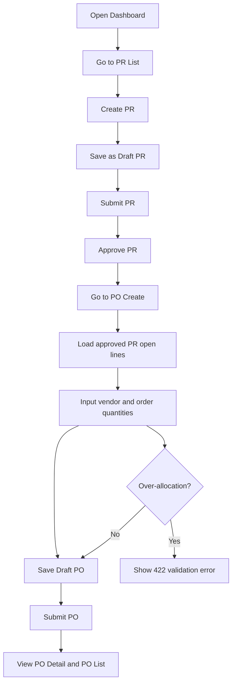
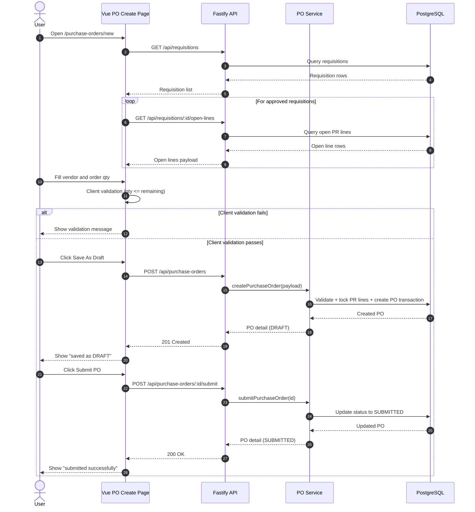

# Procurement MVP - How The Application Works

## Overview
This application is a small procurement workflow MVP with two implemented modules:
- Purchase Requisition (PR)
- Purchase Order (PO)

Goods Receipt (GR) is prepared in schema/planning but not implemented in the current workshop code.

Current stack:
- Frontend: Vue 3 + Vite
- Backend: Fastify REST API
- Database: PostgreSQL (Docker)
- Testing: Jest + Playwright

## High-Level Architecture
1. User opens the Vue web app.
2. Frontend calls Fastify REST endpoints.
3. Backend services apply business rules and read/write PostgreSQL.
4. Response returns to frontend and UI updates status/messages.

## Frontend Pages and Navigation
Implemented routes:
- `/` Dashboard
- `/requisitions` PR List
- `/requisitions/new` PR Create
- `/requisitions/:id` PR Detail
- `/purchase-orders` PO List
- `/purchase-orders/new` PO Create
- `/purchase-orders/:id` PO Detail

Typical behavior:
- Dashboard summarizes and links to PR/PO pages.
- PR module handles requisition lifecycle (`DRAFT -> SUBMITTED -> APPROVED`).
- PO module creates orders from approved PR open lines and supports submit (`DRAFT -> SUBMITTED`).

## Backend API (Current)
### Requisition APIs

| Method | Endpoint | Request (params/body) | Response |
| --- | --- | --- | --- |
| POST | `/api/requisitions` | Body required: `requesterName`, `departmentName`, `title`, `neededByDate`, `lines[]` (minimum 1 line). Each line required: `itemCode`, `itemName`, `qtyRequested`, `uom`, `estUnitPrice`, `siteCode`. | `201` with created PR detail object (header + lines). Validation error: `422 { message }`. |
| POST | `/api/requisitions/:id/submit` | Path param required: `id` (UUID requisition id). Body not required. | `200` with updated PR detail (`status: SUBMITTED`). Not found: `404 { message }`. Invalid state: `422 { message }`. |
| POST | `/api/requisitions/:id/approve` | Path param required: `id` (UUID requisition id). Body not required. | `200` with updated PR detail (`status: APPROVED`). Not found: `404 { message }`. Invalid state: `422 { message }`. |
| GET | `/api/requisitions/:id` | Path param required: `id` (UUID requisition id). | `200` with PR detail (header + lines). Not found: `404 { message }`. |
| GET | `/api/requisitions/:id/open-lines` | Path param required: `id` (UUID requisition id). | `200` with requisition header + open line allocation summary. Not found: `404 { message }`. |

### Purchase Order APIs

| Method | Endpoint | Request (params/body) | Response |
| --- | --- | --- | --- |
| GET | `/api/purchase-orders` | No params, no body. | `200 { items: [...] }` list of PO headers (`id`, `poNumber`, `status`, `vendorName`, `createdAt`, `updatedAt`). |
| POST | `/api/purchase-orders` | Body required: `vendorName`, `lines[]` (minimum 1 line). Each line required: `prLineId`, `itemCode`, `itemName`, `qtyOrdered`, `unitPrice`, `uom`, `siteCode`. Optional: `requiredDate`. | `201` with created PO detail object. Validation error (including over-allocation): `422 { message }`. |
| POST | `/api/purchase-orders/:id/submit` | Path param required: `id` (UUID purchase order id). Body not required. | `200` with updated PO detail (`status: SUBMITTED`). Not found: `404 { message }`. Invalid state: `422 { message }`. |
| GET | `/api/purchase-orders/:id` | Path param required: `id` (UUID purchase order id). | `200` with PO detail (`header`, `lines`, `allocations`). Not found: `404 { message }`. |
| GET | `/api/purchase-orders/:id/open-lines` | Path param required: `id` (UUID purchase order id). | `200` with open PO lines (remaining quantity for receiving). Not found: `404 { message }`. |

### Request/Response Samples

#### Sample: Create Purchase Order

Request

```http
POST /api/purchase-orders
Content-Type: application/json
```

```json
{
  "vendorName": "PT Mitra Teknik",
  "lines": [
    {
      "prLineId": "11111111-1111-1111-1111-111111111001",
      "itemCode": "BRG-6205",
      "itemName": "Bearing 6205",
      "qtyOrdered": 4,
      "unitPrice": 85000,
      "uom": "PCS",
      "siteCode": "JKT-PLANT",
      "requiredDate": "2026-06-20"
    }
  ]
}
```

Response (201)

```json
{
  "id": "940b2c51-89b6-4d6b-84d2-cd5ae9ea36d4",
  "poNumber": "PO-2026-0003",
  "status": "DRAFT",
  "vendorName": "PT Mitra Teknik",
  "createdAt": "2026-06-03T02:10:00.000Z",
  "updatedAt": "2026-06-03T02:10:00.000Z",
  "lines": [
    {
      "id": "22222222-2222-2222-2222-222222222001",
      "lineNo": 1,
      "itemCode": "BRG-6205",
      "itemName": "Bearing 6205",
      "qtyOrdered": 4,
      "qtyReceived": 0,
      "qtyOpenForGr": 4,
      "uom": "PCS",
      "unitPrice": 85000,
      "siteCode": "JKT-PLANT",
      "requiredDate": "2026-06-20",
      "allocations": [
        {
          "prLineId": "11111111-1111-1111-1111-111111111001",
          "prNumber": "PR-2026-0001",
          "prLineNo": 1,
          "allocatedQty": 4
        }
      ]
    }
  ]
}
```

Response (422 over-allocation)

```json
{
  "message": "allocation qty 10 exceeds remaining 4 for BRG-6205"
}
```

#### Sample: Submit Purchase Order

Request

```http
POST /api/purchase-orders/940b2c51-89b6-4d6b-84d2-cd5ae9ea36d4/submit
```

Response (200)

```json
{
  "id": "940b2c51-89b6-4d6b-84d2-cd5ae9ea36d4",
  "poNumber": "PO-2026-0003",
  "status": "SUBMITTED",
  "vendorName": "PT Mitra Teknik",
  "createdAt": "2026-06-03T02:10:00.000Z",
  "updatedAt": "2026-06-03T02:12:00.000Z",
  "lines": []
}
```

## Core Business Rules
1. Only approved PR lines can be allocated into PO.
2. PO allocation quantity cannot exceed PR remaining quantity.
3. PO submit is only allowed from `DRAFT` status.
4. Validation failures return `422` with a clear `message`.

## User Flow (Mermaid Flowchart)


## PO Create Sequence (Mermaid Sequence Diagram)


## What Is Out of Scope (Current Code)
- GR pages and GR API flow implementation in frontend/backend runtime.
- Enterprise features such as SSO, notifications, advanced reporting.

## Quick Run Commands
```bash
docker compose up -d db
npm run dev
```

## Test Commands
```bash
npm test
npx playwright test
```
